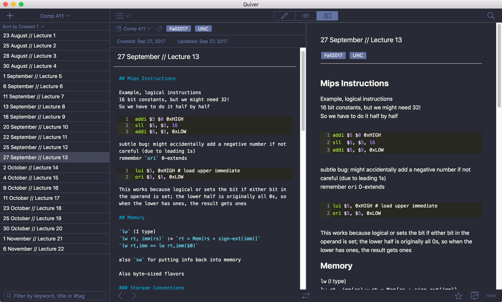

# Dracula for [Quiver](http://happenapps.com/#quiver.com)

> A dark theme for [Quiver](http://happenapps.com/#quiver.com).

## Install

All instructions can be found at [draculatheme.com/quiver](https://draculatheme.com/quiver).

## Team

This theme is maintained by the following person(s) and a bunch of [awesome contributors](https://github.com/dracula/quiver/graphs/contributors).

 | 
--- | ---
[David Knoble](https://github.com/benknoble) | [Zeno Rocha](https://github.com/zenorocha)

## License

[MIT License](./LICENSE)
